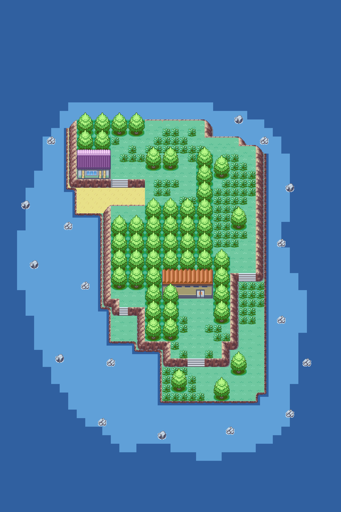
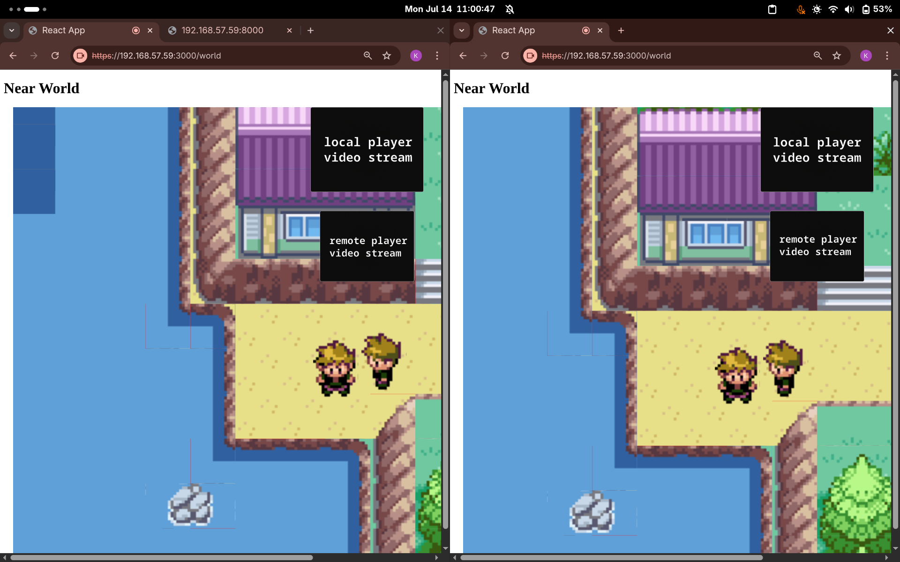

<p align="center" style="font-weight: bold; font-family: monospace; font-size: 36px;">
  nearworld
</p>

<p align="center">
  Proximity-Based WebRTC Streaming for Multiplayer Games
</p>

**Nearworld** is a **proximity-based media streaming system** for multiplayer games, built using **TypeScript**, **Express**, **Socket.IO**, **Mediasoup**, and **Phaser 3**.

When two players come within a specified range on the game map, they can automatically share **audio and video** through **WebRTC** using an SFU (Selective Forwarding Unit) architecture. Media sharing stops automatically once the players move out of range.

## Technologies Used

### Backend (Server)

- **TypeScript**
- **Express.js**
- **Socket.IO**

  - Manages **WebRTC signaling**
  - Synchronizes **real-time player movement**

- **Mediasoup**

  - SFU used to route media streams between connected players

### Frontend (Client)

- **React.js** with **TypeScript**
- **Phaser 3**

  - Handles game rendering and player movement

- **Socket.IO Client**

  - Communicates with the server for signaling and real-time updates

## System Overview

1. A player joins the game.
2. Each player initiates a media stream (camera and microphone).
3. Streams are routed through the **Mediasoup SFU** after signaling via **Socket.IO**.
4. Player positions are synchronized in real-time using WebSockets.
5. When two players come within a predefined range, a WebRTC connection is established.
6. Audio and video are shared only while the players remain in range.
7. Media sharing automatically stops when players move out of range.

## Getting Started

### 1. Clone the Repository

```bash
git clone https://github.com/Kavyansh-Bagdi/nearworld
cd nearworld
```

### 2. Install Dependencies

#### Backend

```bash
cd backend
npm install
```

#### Frontend

```bash
cd ../frontend
npm install
```

### 3. Set Up Self-Signed Certificates

#### Backend

```bash
cd backend
mkdir ssl
openssl req -x509 -newkey rsa:4096 -keyout ssl/key.pem -out ssl/cert.pem -days 365 -nodes
```

#### Frontend

```bash
cd ../frontend
mkdir ssl
openssl req -x509 -newkey rsa:4096 -keyout ssl/key.pem -out ssl/cert.pem -days 365 -nodes
```

### 4. Run in Development Mode

> \[!IMPORTANT]
> Make sure to set up your `.env` files in both the frontend and backend directories based on the provided `.env.example` files.

#### Start the Backend Server

```bash
cd backend
npx tsc
npm start
```

#### Start the Frontend Client

```bash
cd ../frontend
npm run dev
```

> \[!CAUTION]
> Since you're using self-signed certificates, your browser may initially block the URLs. You'll need to bypass the security warning manually.

## Folder Structure

```
/backend   → Backend code (Express, Mediasoup, Socket.IO)
/frontend  → Frontend code (React, Phaser 3, WebRTC)
```

## In Progress

Planned improvements:

- Improve media quality and handle disconnections cleanly
- Add UI indicators when players are within proximity
- Optimize synchronization of real-time player movement

## Preview




